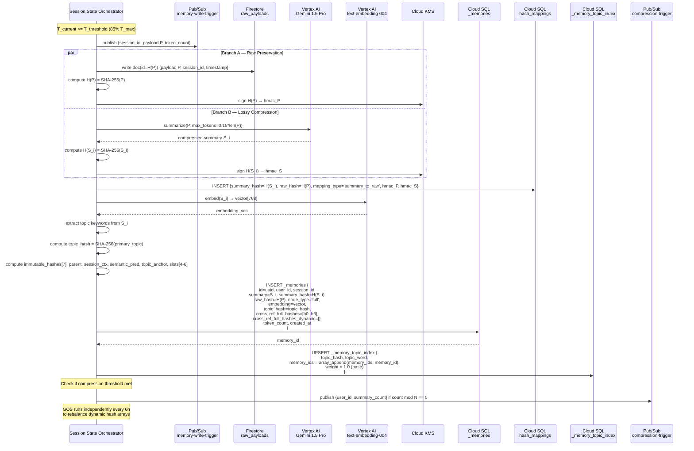
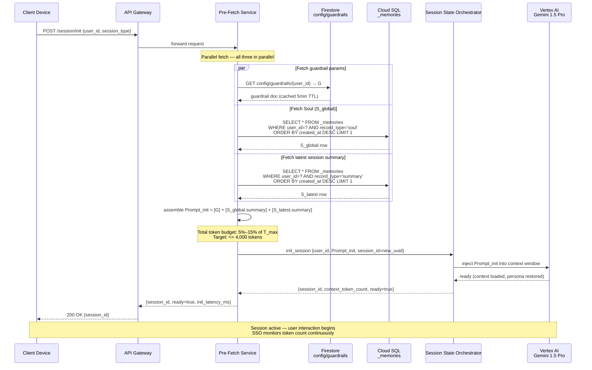

# Soul AI Memory — GCP Architecture Design
**Issue:** SAL-369
**Prepared:** 2026-03-02
**Architects:** JARVIS (Data & Systems) + Forge (Cloud)
**Scope:** WAVE-1 production GCP architecture for the Soul AI Memory patent implementation
**Patent coverage:** Parent (dual-path storage, dual-integrity hashing, recursive compression, pre-fetch) + Continuation (hash-graph v2, TKHR-Index, GOS scheduler, 3-node density spectrum, GDPR erasure)

---

## 1. Patent → GCP Component Mapping

| Inventive Element | Patent Section | GCP Service | Rationale |
|---|---|---|---|
| Session State Orchestrator (SSO) | §7.1, §7.2 | Cloud Run (session-orchestrator service) | Stateless, event-driven; scales to zero between sessions; 2nd-gen min-instances = 1 for sub-200ms cold start |
| Active Context Window token monitor | §7.2 | Cloud Run (in-process, SSO service) | Token counter lives in SSO memory; triggers Pub/Sub message on threshold crossing |
| Context threshold trigger (85% T_max) | §7.2 | Cloud Pub/Sub (topic: `memory-write-trigger`) | Decouples threshold detection from dual-path fan-out; at-least-once delivery |
| Branch A — Raw Payload storage | §7.3 | Firestore (hot tier, `raw_payloads` collection) | High-throughput unstructured text writes; content-addressable by H(P) document ID |
| Branch B — Compressed Summary (AI) | §7.3 | Vertex AI (Gemini 1.5 Pro via API) | Structured summarization protocol; 15% byte-budget constraint; managed inference |
| H(P) + H(S) SHA-256 computation | §7.3 | Cloud Run (SSO, in-process) | SHA-256 is CPU-bound; computed inline before KMS verification step |
| Cryptographic Hash Mapping Table | §7.3, §7.7 | Cloud SQL PostgreSQL (`hash_mappings` table) | Bidirectional O(1) lookup; indexed on both columns; ACID-compliant tamper log |
| Summary Database | §7.4, §7.7 | Cloud SQL PostgreSQL (`_memories` table) | Structured records with node_type, hash arrays, dual-integrity hashes, embeddings |
| Recursive compression trigger | §7.4 | Cloud Scheduler + Pub/Sub (`soul-synthesis-trigger`) | Cron-based; also event-driven on accumulated summary count threshold |
| Soul (S_global) synthesis | §7.4 | Vertex AI (Gemini 1.5 Pro, large context) | Aggregates N summaries into Soul; writes result back to Cloud SQL |
| Pre-fetch state-loading protocol | §7.5 | Cloud Run (pre-fetch service) | Assembles Prompt_init = [G] + [S_global] + [S_latest]; target < 200ms |
| Guardrail parameters (G) | §7.5 | Cloud Firestore (`config/guardrails` doc) | Low-latency config read; versioned; cached in pre-fetch service memory |
| Multi-tier semantic recall | §7.6 | Vertex AI Vector Search (HNSW index) | ANN search over compressed summary embeddings; sub-linear over large corpus |
| Embedding generation | §7.6 | Vertex AI text-embedding-004 | 768-dim embeddings for summaries; batch at write time |
| O(1) hash-addressed raw retrieval | §7.6 | Firestore (document ID = H(P)) | Native content-addressable lookup; no full-text scan |
| Hash integrity verification | §7.3, §7.6 | Cloud KMS (HMAC key ring: `soul-integrity`) | Signs and verifies H(P), H(S) on retrieval; detects tampering |
| _memories table (Cloud SQL) | §7.7 + Part C | Cloud SQL PostgreSQL 15 | Full schema per Part C: node_type, cross_ref_full_hashes[7], cross_ref_full_hashes_dynamic[7] |
| TKHR-Index | §7.9, B-1 Layer 3 | Cloud SQL (`_memory_topic_index` table) | SHA-256(topic_word) → memory_ids array; PK lookup = O(1); weight column added |
| Hash-graph dual-layer (7+7 edges) | §7.9, B-1 | Cloud SQL PostgreSQL (GIN-indexed TEXT[] columns) | Immutable + dynamic arrays on _memories; GIN index for containment queries |
| GOS scheduler (load rebalance) | §7.9, B-2 | Cloud Run Jobs (gos-scheduler, every 6h) | Stateless batch job; O(N) measurement + rewiring; writes _memory_rebalance_log |
| Small-world validation | B-2 step 4 | Cloud Run Jobs (gos-scheduler, inline) | BFS sample on 1% node pairs; inserts synthetic PGN bridge nodes if L̄ violated |
| Node type field (Full/CAN/PGN) | §7.9, B-1 Layer 4 | Cloud SQL `_memories.node_type` column | Enum: 'full', 'context', 'graph'; controls content loading and GOS weight |
| GDPR erasure pathway | §7.9, B-1 | Cloud Run (erasure-service) + Cloud SQL | Nullifies payload/summary; downgrades node_type; logs to _memory_rebalance_log |
| Rebalance audit log | B-2, B-1 | Cloud SQL (`_memory_rebalance_log` table) | Append-only; GDPR deletion certificates stored here |
| Async compression trigger | §7.4 | Cloud Pub/Sub (`compression-trigger`) | Summary-count threshold triggers Soul synthesis asynchronously |
| Session isolation (multiuser) | §7.8 | Cloud SQL row-level security + Firestore security rules | Per-user `user_id` partition; RLS policy on all _memories queries |

---

## 2. System Architecture (Mermaid)

```mermaid
graph TB
    subgraph Client["Client Layer"]
        CD[Client Device / Agent Process]
        APIGW[API Gateway<br/>Cloud Run / API Gateway]
    end

    subgraph Orchestration["Orchestration Layer — Cloud Run"]
        SSO[Session State Orchestrator<br/>session-orchestrator:8080<br/>min-instances=1]
        PFS[Pre-Fetch Service<br/>pre-fetch:8080<br/>min-instances=1]
        TKHR_SVC[TKHR Service<br/>tkhr-service:8080]
        ERASURE[Erasure Service<br/>erasure-service:8080]
    end

    subgraph AsyncLayer["Async Layer — Pub/Sub"]
        PS_MWT[memory-write-trigger<br/>Pub/Sub Topic]
        PS_COMP[compression-trigger<br/>Pub/Sub Topic]
        PS_SOUL[soul-synthesis-trigger<br/>Pub/Sub Topic]
        SCHED[Cloud Scheduler<br/>every 6h → GOS<br/>every 24h → Soul Synthesis]
    end

    subgraph AI["AI Inference Layer — Vertex AI"]
        GEMINI[Gemini 1.5 Pro<br/>Summarization + Soul Synthesis]
        EMBED[text-embedding-004<br/>768-dim embeddings]
        VS[Vector Search<br/>HNSW Index<br/>soul-memories-index]
    end

    subgraph HotTier["Hot Tier — Firestore"]
        FS_RAW[raw_payloads collection<br/>doc_id = H(P)<br/>TTL = 90 days hot]
        FS_CFG[config/guardrails<br/>Guardrail params G]
        FS_SESS[sessions collection<br/>active session state]
    end

    subgraph ColdTier["Cold Tier — Cloud SQL PostgreSQL 15"]
        SQL_MEM[_memories table<br/>node_type, dual-hash arrays<br/>embeddings, content]
        SQL_HASH[hash_mappings table<br/>H(S) ↔ H(P) bidirectional]
        SQL_TKHR[_memory_topic_index<br/>SHA-256(topic) → memory_ids<br/>+ weight column]
        SQL_LOG[_memory_rebalance_log<br/>append-only audit]
    end

    subgraph Security["Security — KMS"]
        KMS[Cloud KMS<br/>soul-integrity key ring<br/>HMAC verification]
    end

    subgraph Jobs["Batch Jobs — Cloud Run Jobs"]
        GOS[GOS Scheduler Job<br/>every 6h<br/>O(N) load rebalance]
        SOUL_JOB[Soul Synthesis Job<br/>triggered by Scheduler/Pub/Sub]
    end

    CD -->|HTTPS| APIGW
    APIGW --> SSO
    SSO -->|token count >= 85% T_max| PS_MWT
    PS_MWT -->|Branch A| FS_RAW
    PS_MWT -->|Branch B trigger| SSO
    SSO -->|summarize| GEMINI
    GEMINI -->|S_i| SSO
    SSO -->|H(P), H(S)| KMS
    KMS -->|HMAC sig| SSO
    SSO -->|write hash_mappings| SQL_HASH
    SSO -->|write _memories row| SQL_MEM
    SSO -->|embed S_i| EMBED
    EMBED -->|768-dim vec| SQL_MEM
    EMBED -->|upsert to index| VS
    SSO -->|upsert TKHR| SQL_TKHR
    SSO -->|publish| PS_COMP

    PS_COMP --> SOUL_JOB
    SCHED --> SOUL_JOB
    SCHED --> GOS
    SOUL_JOB -->|fetch summaries| SQL_MEM
    SOUL_JOB -->|synthesize Soul| GEMINI
    SOUL_JOB -->|write S_global| SQL_MEM
    SOUL_JOB -->|write hash record| SQL_HASH

    PFS -->|fetch S_global| SQL_MEM
    PFS -->|fetch S_latest| SQL_MEM
    PFS -->|fetch G| FS_CFG
    PFS -->|assemble Prompt_init| SSO

    TKHR_SVC -->|SHA-256(topic)| SQL_TKHR
    TKHR_SVC -->|fetch memories| SQL_MEM

    GOS -->|measure load| SQL_MEM
    GOS -->|rewire dynamic hashes| SQL_MEM
    GOS -->|log changes| SQL_LOG
    GOS -->|insert PGN bridges| SQL_MEM

    ERASURE -->|nullify payload/summary| SQL_MEM
    ERASURE -->|downgrade node_type| SQL_MEM
    ERASURE -->|write erasure cert| SQL_LOG

    SSO -->|semantic recall| VS
    VS -->|top-k summary_ids| SSO
    SSO -->|O(1) hash lookup| SQL_HASH
    SSO -->|fetch raw payload| FS_RAW
```

---

## 3. Data Flow Diagrams

### 3a. Memory Write Path



### 3b. Session Initialization (Pre-fetch) Path



---

## 4. Hot/Cold Tier Design

### 4a. Firestore Hot Tier Schema

**Collection: `raw_payloads`**

```
Document ID: SHA-256(raw_payload_text)   ← content-addressable

Fields:
  payload          : string              ← full-text context window content
  session_id       : string
  user_id          : string
  timestamp_utc    : timestamp
  token_count      : integer
  byte_length      : integer
  integrity_status : string              ← 'unverified' | 'verified' | 'tampered'
  hmac_signature   : string              ← Cloud KMS HMAC over H(P)
  ttl              : timestamp           ← Firestore TTL field (90 days hot)
```

**Collection: `sessions`**

```
Document ID: session_id (UUID)

Fields:
  user_id          : string
  started_at       : timestamp
  last_active      : timestamp
  token_count      : integer
  threshold_pct    : float               ← configurable per user (default 0.85)
  status           : string              ← 'active' | 'closing' | 'closed'
  soul_hash        : string              ← H(S_global) used for this session
```

**Collection: `config`**

```
Document ID: 'guardrails/{user_id}'

Fields:
  system_prompt    : string              ← behavioral constraints G
  safety_bounds    : map
  role_definition  : string
  max_tokens       : integer
  version          : integer
  updated_at       : timestamp
```

### 4b. Cloud SQL Cold Tier Schema

```sql
-- Core memories table (parent + continuation schema combined)
CREATE TABLE public._memories (
  id                          UUID        PRIMARY KEY DEFAULT gen_random_uuid(),
  user_id                     TEXT        NOT NULL,
  session_id                  TEXT        NOT NULL,

  -- Content fields (nulled on erasure)
  raw_hash                    TEXT,                          -- H(P), FK to hash_mappings
  summary                     TEXT,                         -- compressed summary S_i
  summary_hash                TEXT,                         -- H(S_i)
  embedding                   vector(768),                  -- pgvector embedding

  -- Node type (Full / CAN / PGN)
  node_type                   TEXT        NOT NULL DEFAULT 'full'
                              CHECK (node_type IN ('full', 'context', 'graph')),

  -- Record classification
  record_type                 TEXT        NOT NULL DEFAULT 'summary'
                              CHECK (record_type IN ('summary', 'soul', 'session_boundary')),

  -- Topic routing
  topic_hash                  TEXT,                         -- SHA-256(primary_topic)
  topic_word                  TEXT,                         -- canonical topic (debug)

  -- Hash-graph v2 dual-layer (14 edges total)
  cross_ref_full_hashes       TEXT[]      NOT NULL DEFAULT '{}',  -- immutable[7]
  cross_ref_full_hashes_dynamic TEXT[]    NOT NULL DEFAULT '{}',  -- mutable[7]

  -- Integrity
  hmac_signature              TEXT,                         -- KMS HMAC over summary_hash
  integrity_verified_at       TIMESTAMPTZ,

  -- Metadata
  token_count                 INTEGER,
  byte_length                 INTEGER,
  query_access_count          INTEGER     NOT NULL DEFAULT 0,
  last_accessed_at            TIMESTAMPTZ,
  created_at                  TIMESTAMPTZ NOT NULL DEFAULT now(),
  updated_at                  TIMESTAMPTZ NOT NULL DEFAULT now()
);

-- Bidirectional hash mapping table (Cryptographic Hash Mapping Table §7.3)
CREATE TABLE public.hash_mappings (
  id                 UUID        PRIMARY KEY DEFAULT gen_random_uuid(),
  summary_hash       TEXT        NOT NULL,                  -- H(S_i)
  raw_hash           TEXT        NOT NULL,                  -- H(P_i)
  mapping_type       TEXT        NOT NULL DEFAULT 'summary_to_raw'
                     CHECK (mapping_type IN ('summary_to_raw', 'soul_to_summaries')),
  parent_hashes      TEXT[]      NOT NULL DEFAULT '{}',     -- for soul→summaries mapping
  hmac_p             TEXT,                                  -- KMS HMAC over H(P)
  hmac_s             TEXT,                                  -- KMS HMAC over H(S)
  verification_count INTEGER     NOT NULL DEFAULT 0,
  created_at         TIMESTAMPTZ NOT NULL DEFAULT now()
);

-- TKHR-Index (Topic-Keyed Hash Routing Index, §7.9 / B-1 Layer 3)
CREATE TABLE public._memory_topic_index (
  topic_hash   TEXT        PRIMARY KEY,                     -- SHA-256(lowercase(topic_word))
  topic_word   TEXT        NOT NULL,
  memory_ids   TEXT[]      NOT NULL DEFAULT '{}',
  weight       FLOAT       NOT NULL DEFAULT 1.0,            -- personalization weight (the ONLY adjustable field)
  last_updated TIMESTAMPTZ NOT NULL DEFAULT now()
);

-- GOS rebalance audit log
CREATE TABLE public._memory_rebalance_log (
  id              UUID        PRIMARY KEY DEFAULT gen_random_uuid(),
  run_at          TIMESTAMPTZ NOT NULL DEFAULT now(),
  memory_id       TEXT        NOT NULL,
  operation       TEXT        NOT NULL                      -- 'rewire' | 'erasure' | 'bridge_insert'
                  CHECK (operation IN ('rewire', 'erasure', 'bridge_insert')),
  hashes_removed  TEXT[]      NOT NULL DEFAULT '{}',
  hashes_added    TEXT[]      NOT NULL DEFAULT '{}',
  old_load_score  FLOAT,
  new_load_score  FLOAT,
  erasure_cert    JSONB                                     -- for GDPR deletion certificates
);
```

**Indexes:**

```sql
-- _memories performance indexes
CREATE INDEX idx_memories_user_session   ON _memories (user_id, session_id);
CREATE INDEX idx_memories_user_type      ON _memories (user_id, record_type, created_at DESC);
CREATE INDEX idx_memories_topic_hash     ON _memories (topic_hash);
CREATE INDEX idx_memories_raw_hash       ON _memories (raw_hash);
CREATE INDEX idx_memories_node_type      ON _memories (node_type);
CREATE INDEX idx_memories_static_refs    ON _memories USING GIN (cross_ref_full_hashes);
CREATE INDEX idx_memories_dynamic_refs   ON _memories USING GIN (cross_ref_full_hashes_dynamic);
CREATE INDEX idx_memories_embedding      ON _memories USING ivfflat (embedding vector_cosine_ops)
                                         WITH (lists = 100);

-- hash_mappings
CREATE UNIQUE INDEX idx_hash_map_summary ON hash_mappings (summary_hash);
CREATE INDEX idx_hash_map_raw            ON hash_mappings (raw_hash);

-- TKHR-Index
CREATE INDEX idx_tkhr_topic_word         ON _memory_topic_index (topic_word);
CREATE INDEX idx_tkhr_weight             ON _memory_topic_index (weight DESC);
```

### 4c. TTL and Promotion/Demotion Rules

| Rule | Condition | Action |
|---|---|---|
| Hot-tier TTL expiry | Firestore raw_payload TTL = 90 days (default); configurable per user tier | Document auto-deleted by Firestore TTL service; Cloud SQL `raw_hash` remains as provenance pointer |
| Hot-tier retention extension | `query_access_count` incremented in session | Pre-fetch service updates TTL on access: `ttl = now() + 90d` |
| Cold-tier archival | Summary older than 365 days AND access_count = 0 | Cloud SQL partition archival to Cloud Storage (Avro export via Cloud Run Job, monthly) |
| Hot→Cold promotion (summary) | New summary written | Always written to Cloud SQL immediately; Firestore raw payload stays hot for 90d |
| Cold→Archive demotion | Record age > 365 days, access_count = 0 | Export to Cloud Storage JSONL; mark archived=true in Cloud SQL (row retained for hash graph integrity) |
| Pre-fetch cache warm | Session init | Pre-fetch service caches S_global in Cloud Run instance memory (10-min TTL); eliminates SQL round-trip on repeat session starts |

---

## 5. TKHR-Index Design

### Schema

```sql
CREATE TABLE public._memory_topic_index (
  topic_hash   TEXT        PRIMARY KEY,    -- SHA-256(lowercase(normalize(topic_word)))
  topic_word   TEXT        NOT NULL,       -- canonical topic for debugging / logging
  memory_ids   TEXT[]      NOT NULL DEFAULT '{}',  -- array of _memories.id values
  weight       FLOAT       NOT NULL DEFAULT 1.0,   -- THE ONLY ADJUSTABLE FIELD
  last_updated TIMESTAMPTZ NOT NULL DEFAULT now()
);
```

**The `weight` column is the single configurable field.** All other columns are structural. Weight governs personalization scoring during multi-topic retrieval.

### Weight Lifecycle

**1. Initial population (memory write time)**

When a new memory is written and topic extraction yields `topic_word`:
```
topic_hash = SHA-256(lowercase(topic_word))
UPSERT _memory_topic_index
  ON CONFLICT (topic_hash) DO UPDATE
    memory_ids = array_append(memory_ids, new_memory_id),
    weight = weight  -- unchanged on write; write does not boost weight
    last_updated = now()
```
Initial weight = 1.0 (base neutral).

**2. Weight boost on access**

When the SSO resolves a topic during a session retrieval query:
```
UPDATE _memory_topic_index
SET weight = LEAST(weight + 0.1, 5.0),   -- cap at 5.0 to prevent runaway
    last_updated = now()
WHERE topic_hash = $1
```
Access boost = +0.1 per hit, capped at 5.0.

**3. Weight boost at session start (pre-fetch)**

When the pre-fetch service assembles Prompt_init, it reads the user's `_memories` Soul record, extracts the top-10 topics mentioned in S_global, and applies a session-start boost:
```
UPDATE _memory_topic_index
SET weight = LEAST(weight + 0.2, 5.0),
    last_updated = now()
WHERE topic_hash = ANY($top_10_topic_hashes)
```
Session-start boost = +0.2 for all Soul-referenced topics.

**4. Weight decay on session end**

When SSO closes a session and writes the closing summary S_i, a post-close Cloud Run job runs weight decay across all topics not accessed in the session:
```
UPDATE _memory_topic_index
SET weight = GREATEST(weight * 0.95, 1.0),   -- 5% decay, floor at 1.0
    last_updated = now()
WHERE topic_hash NOT IN (SELECT UNNEST($accessed_topic_hashes))
  AND user_id = $user_id
```
Decay = 5% multiplicative per session end, floor = 1.0 (never below base).

### Multi-Topic Weighted Retrieval Scoring Formula

When a query contains multiple topic keywords `[t_1, t_2, ..., t_k]`:

```
score(memory_id) = SUM(  weight_i  FOR EACH topic_hash_i WHERE memory_id IN memory_ids_i  )
```

Where `weight_i` is the current weight value in `_memory_topic_index` for topic `t_i`.

**Example:** Memory M is indexed under topics "cryptography" (weight=3.2) and "session management" (weight=1.8). Query contains both topics.

```
score(M) = 3.2 + 1.8 = 5.0
```

A memory indexed under only "cryptography" (weight=3.2) would score 3.2. Memory M wins retrieval priority.

**Implementation:**

```sql
SELECT m.id, m.summary, SUM(t.weight) AS retrieval_score
FROM _memories m
JOIN _memory_topic_index t ON m.id = ANY(t.memory_ids)
WHERE t.topic_hash = ANY($query_topic_hashes)
  AND m.user_id = $user_id
  AND m.node_type != 'graph'   -- PGN nodes have no content to return
GROUP BY m.id, m.summary
ORDER BY retrieval_score DESC
LIMIT $k;
```

---

## 6. Hash-Graph v2 Architecture

### 6a. Dual-Layer Design

Each `_memories` row stores exactly 14 edge slots split across two logically and physically distinct columns:

| Layer | Column | Count | Mutability | Purpose |
|---|---|---|---|---|
| Immutable Provenance | `cross_ref_full_hashes` | 7 | Written once at CREATE; never modified | Tamper-evident provenance tracing; audit chain |
| Mutable Dynamic | `cross_ref_full_hashes_dynamic` | 7 | Managed by GOS scheduler every 6h | Load balancing; small-world connectivity |

**Immutable slot assignments (index-stable):**

| Index | Meaning |
|---|---|
| [0] | Parent memory hash — what this memory was derived from |
| [1] | Source session context hash — SHA-256(session_id) at creation |
| [2] | Semantic predecessor — most semantically similar prior memory (by cosine distance at write time) |
| [3] | Topic anchor hash — SHA-256(primary_topic_word) per TKHR-Index |
| [4] | Application-defined slot A (e.g., project/task hash) |
| [5] | Application-defined slot B (e.g., user persona hash) |
| [6] | Application-defined slot C (reserved / future use) |

**Dynamic slot management:** GOS fills dynamic slots based on load distribution algorithm described in Section 8 (GOS Scheduler).

### 6b. Three Node Types

| Type | Enum | Contains | Does NOT Contain | Storage Estimate | Use Case |
|---|---|---|---|---|---|
| Full Node | `'full'` | raw_hash, summary, session_id, topic_hash, embedding, immutable_hashes[7], dynamic_hashes[7] | — | ~8–50 KB (summary text dominates) | Default; all normal memory writes |
| Context-Anchored Node (CAN) | `'context'` | session_id, topic_hash, topic_word, immutable_hashes[7], dynamic_hashes[7] | raw_hash, summary, embedding | ~200 bytes (context fields + 14×32 bytes) | Session boundary markers; topic routing waypoints; partial redaction intermediate state |
| Pure Graph Node (PGN) | `'graph'` | immutable_hashes[7], dynamic_hashes[7], UUID, timestamps | raw_hash, summary, session_id, topic_hash, embedding | ~448 bytes (14×32-byte hashes + UUID + 2 timestamps) | GDPR terminal erasure state; synthetic GOS bridge nodes; disconnected-cluster connectors |

**GOS load weighting by node type:**

```
load_weight = {
  'full':    1.0,   -- normal weight; content and traversal cost both count
  'context': 0.5,   -- reduced weight; low retrieval cost, modest traversal cost
  'graph':   0.0    -- zero content load weight; counted only for traversal hops
}
```

### 6c. GOS Scheduler: Rebalance Trigger and Watts-Strogatz Invariant

**Trigger conditions (either/or):**

1. Cloud Scheduler cron: every 6 hours (`0 */6 * * *`)
2. Node count >= 100 (skip if below threshold — graph too small for optimization value)
3. Manual trigger via Pub/Sub message to `gos-trigger` topic (for emergency rebalance)

**Algorithm (Cloud Run Job: `gos-scheduler`):**

```
PHASE 1 — MEASUREMENT:
  For each memory record m in _memories (WHERE user_id = $user_id):
    inbound_dynamic[m] = COUNT of rows where m.id appears in cross_ref_full_hashes_dynamic
    access_freq[m]     = m.query_access_count / days_since_oldest_record   (normalized rate)
    load_score[m]      = α × inbound_dynamic[m] + β × access_freq[m]
                         (default α=0.6, β=0.4)
  mean_load  = AVG(load_score)
  std_load   = STDDEV(load_score)

PHASE 2 — IDENTIFICATION:
  hot_nodes  = {m | load_score[m] > mean_load + 1.5 × std_load}   -- ~13% of nodes
  cold_nodes = {m | load_score[m] < mean_load - 1.5 × std_load}   -- ~13% of nodes

PHASE 3 — REWIRING:
  For each hot_node h in hot_nodes:
    Find semantically equivalent cold_node c (same topic_hash OR closest embedding)
    N = edges needed to bring both within 1σ of mean_load
    UPDATE h.cross_ref_full_hashes_dynamic: replace N entries with hash(c.id)
    Log change to _memory_rebalance_log

PHASE 4 — SMALL-WORLD VALIDATION:
  Sample 1% of node pairs → BFS traversal → compute L̄ (mean shortest path)
  Invariant: L̄ ≤ log(N) / log(14)   [k=14: 7 static + 7 dynamic edges]

  If L̄ > log(N)/log(14) + 0.5:
    Identify disconnected clusters via BFS
    For each disconnected pair (cluster_A, cluster_B):
      Insert new PGN bridge node with:
        cross_ref_full_hashes[0] = SHA-256(representative_node_A.id)
        cross_ref_full_hashes[3] = SHA-256(representative_node_B.id)
        node_type = 'graph'
      Update both representative nodes' dynamic arrays to include bridge node hash
    Re-sample until L̄ invariant satisfied

PHASE 5 — COMMIT:
  Batch UPDATE _memories SET cross_ref_full_hashes_dynamic = new_array
  WHERE id IN (rewired_node_ids)
  INSERT INTO _memory_rebalance_log (all changes)
```

**Watts-Strogatz invariant targets by scale:**

| N (memories) | L̄ target | L̄ = log(N)/log(14) | Typical hops |
|---|---|---|---|
| 1,000 | ≤ 2.8 | 2.78 | 3 |
| 10,000 | ≤ 3.6 | 3.58 | 4 |
| 100,000 | ≤ 4.4 | 4.37 | 4–5 |
| 1,000,000 | ≤ 5.2 | 5.17 | 5–6 |

---

## 7. GDPR Erasure Pathway

### Trigger

POST `/erasure/user/{user_id}/memory/{memory_id}` → Cloud Run `erasure-service`

### Full→PGN Downgrade Protocol

**Data removed (nullified in place — record is NOT deleted):**

| Field | Action | Reason |
|---|---|---|
| `summary` | SET NULL | Contains compressed content — erasure obligation |
| `raw_hash` | SET NULL | Pointer to raw payload; decoupled from hash graph |
| `embedding` | SET NULL | Embedding is derived from content — erasure obligation |
| `topic_word` | SET NULL | Human-readable topic label |
| `topic_hash` | SET NULL | SHA-256 of topic (PGN needs no routing) |
| `session_id` | SET NULL | May be identifying; erased at 'graph' level |

**Data preserved (mandatory for graph topology integrity):**

| Field | Preserved Value | Reason |
|---|---|---|
| `id` | UUID unchanged | Other nodes reference this ID in their hash arrays |
| `cross_ref_full_hashes` | Unchanged (immutable by design) | Inbound references from other nodes must remain resolvable |
| `cross_ref_full_hashes_dynamic` | Unchanged | GOS scheduler will naturally rewire away from erased nodes over time |
| `node_type` | Set to `'graph'` | Signals PGN status to all consumers |
| `created_at` | Preserved | Minimal timestamp for audit compliance |
| `updated_at` | Updated to erasure timestamp | Audit trail |

**Hash topology maintenance:**

No inbound hash references from other memory nodes become dangling because the record itself is never deleted — only its content is nullified. Any node traversal that resolves to this record's hash will successfully find the PGN row, observe `node_type='graph'`, and skip content loading. The traversal continues through the preserved `cross_ref_full_hashes` edges to find semantically related non-erased nodes.

**Downgrade sequence:**

```
Step 1: Full → CAN (if session context must be retained for audit)
  UPDATE _memories SET
    summary = NULL, raw_hash = NULL, embedding = NULL,
    node_type = 'context'
  WHERE id = $memory_id AND user_id = $user_id

Step 2: CAN → PGN (full erasure including context)
  UPDATE _memories SET
    session_id = NULL, topic_word = NULL, topic_hash = NULL,
    node_type = 'graph'
  WHERE id = $memory_id AND user_id = $user_id

Step 3: Remove from TKHR-Index
  UPDATE _memory_topic_index SET
    memory_ids = array_remove(memory_ids, $memory_id)
  WHERE $memory_id = ANY(memory_ids)

Step 4: Remove raw payload from Firestore (if within TTL)
  DELETE raw_payloads/{H(P)}

Step 5: Write deletion certificate to _memory_rebalance_log
  INSERT _memory_rebalance_log {
    memory_id, operation='erasure',
    erasure_cert = {
      erased_at: now(),
      regulation: 'GDPR Art. 17',
      fields_nullified: [...],
      node_type_after: 'graph',
      hash_refs_preserved: cross_ref_full_hashes,
      certifying_service: 'erasure-service',
      request_id: $request_id
    }
  }
```

**Deletion certificate fields (stored in `_memory_rebalance_log.erasure_cert` JSONB):**

```json
{
  "erased_at": "2026-03-02T12:00:00Z",
  "memory_id": "uuid",
  "user_id": "sha256_of_user_id",
  "regulation": "GDPR Article 17",
  "fields_nullified": ["summary", "raw_hash", "embedding", "topic_word", "topic_hash", "session_id"],
  "node_type_before": "full",
  "node_type_after": "graph",
  "hash_refs_preserved": ["h0", "h1", "h2", "h3", "h4", "h5", "h6"],
  "graph_topology_intact": true,
  "raw_payload_deleted": true,
  "certifying_service": "erasure-service-v1",
  "request_id": "req_uuid"
}
```

---

## 8. Pre-fetch Optimization (< 200ms Cold Start)

### Target

Session initialization for a user with up to 10,000 memories: end-to-end latency < 200ms from API Gateway to `ready=true` response.

### Latency Budget Decomposition

| Step | Service | Target Latency | Notes |
|---|---|---|---|
| API Gateway routing | Cloud API Gateway | 5ms | Regional endpoint |
| Pre-fetch service cold start | Cloud Run (min-instances=1) | 0ms | min-instances=1 eliminates cold start |
| Guardrail fetch (G) | Firestore (cached) | 5ms | In-memory cache; 5-min TTL in Cloud Run instance |
| S_global fetch | Cloud SQL (indexed query) | 20ms | Indexed on (user_id, record_type, created_at DESC) |
| S_latest fetch | Cloud SQL (indexed query) | 20ms | Same index; parallel with S_global |
| Prompt_init assembly | In-memory string concat | 1ms | No I/O |
| SSO context injection | Cloud Run → Vertex AI | 120ms | Gemini streaming; first token within 120ms |
| Response return | Cloud Run → API GW | 5ms | |
| **Total** | | **~176ms** | Leaves 24ms margin |

### Caching Strategy

**Layer 1 — Cloud Run instance memory (fastest)**
- Cache `G` (guardrail params) per user: 5-min TTL, invalidated on update
- Cache S_global (per user): 10-min TTL; invalidated when Soul Synthesis Job writes new Soul
- Estimated size: ~4KB per user; at 1,000 concurrent sessions = 4MB — trivially within Cloud Run memory

**Layer 2 — Cloud SQL read replica**
- Pre-fetch service connects to Cloud SQL read replica (not primary)
- Eliminates write-path contention during high session-init load
- Replication lag < 50ms; acceptable for pre-fetch (S_latest from prior session)

**Layer 3 — Parallel fetch execution**
- Pre-fetch service issues G, S_global, and S_latest queries in parallel (async Python / Go coroutines)
- Fan-out latency = MAX(individual latencies) not SUM

### Payload Size Budget

```
Prompt_init = [G] + [S_global] + [S_latest]

G (guardrails):        ~200–500 tokens   (system prompt + safety bounds)
S_global (Soul):       ~500–4,000 tokens (per §7.4, target 500–4,000 token footprint)
S_latest (summary):    ~200–1,000 tokens (15% of original session, typical session = 6,000 tokens)

Total Prompt_init:     ~900–5,500 tokens
T_max (Gemini 1.5 Pro): 1,048,576 tokens
Budget usage:          0.09% – 0.52% of T_max  ← 5%–15% spec target easily met
```

### Parallel Fetch Implementation

```python
# pre_fetch_service.py (Cloud Run)
import asyncio

async def build_prompt_init(user_id: str) -> dict:
    guardrails_task = asyncio.create_task(fetch_guardrails(user_id))   # Firestore
    soul_task       = asyncio.create_task(fetch_soul(user_id))          # Cloud SQL
    latest_task     = asyncio.create_task(fetch_latest_summary(user_id)) # Cloud SQL

    G, S_global, S_latest = await asyncio.gather(
        guardrails_task, soul_task, latest_task
    )

    return {
        "prompt_init": f"{G}\n\n{S_global}\n\n{S_latest}",
        "token_estimate": estimate_tokens(G, S_global, S_latest),
        "soul_hash": S_global.summary_hash,
        "session_context_hashes": [S_latest.summary_hash]
    }
```

---

## 9. HNSW Vector Search Design

### Vertex AI Vector Search Configuration

```yaml
index:
  displayName: soul-memories-index
  indexUpdateMethod: STREAM_UPDATE          # real-time updates as summaries are written
  metadata:
    contentsDeltaUri: gs://soul-embeddings-bucket/
    config:
      dimensions: 768                       # text-embedding-004 output dimension
      approximateNeighborsCount: 150        # over-fetch factor (return 150, filter to k)
      distanceMeasureType: COSINE_DISTANCE  # cosine similarity for semantic recall
      featureNormType: UNIT_L2_NORM         # normalize before cosine computation
      algorithmConfig:
        treeAhConfig:
          leafNodeEmbeddingCount: 500       # leaves per tree node
          leafNodesToSearchPercent: 10      # % of leaves searched per query

index_endpoint:
  displayName: soul-memories-endpoint
  network: projects/{project}/global/networks/soul-vpc
  deployedIndexes:
    - id: soul-memories-deployed
      displayName: soul-memories-deployed
      minReplicaCount: 1
      maxReplicaCount: 5                    # auto-scale based on QPS
      dedicatedResources:
        machineSpec:
          machineType: n1-standard-16
        minReplicaCount: 1
        maxReplicaCount: 5
```

### When to Use HNSW vs TKHR-Index

| Query Type | Method | Reason |
|---|---|---|
| "Find memories about project Alpha" | TKHR-Index (keyword exact) | Topic keyword is exact; O(1) lookup; < 5ms |
| "Find memories related to what we discussed last Tuesday about cryptography" | HNSW Vector Search | Semantic/temporal; no exact keyword; embedding similarity |
| "Recall context about SHA-256 and provenance" | TKHR-Index + HNSW fusion | Exact keyword "SHA-256" triggers TKHR; semantic expansion via HNSW for related concepts |
| "What have I told the AI about my preferences?" | HNSW Vector Search | Open-ended semantic; no single topic keyword |
| "Verify integrity of memory M" | Direct hash lookup (Cloud SQL) | Exact O(1) lookup by summary_hash or raw_hash |
| "Get all memories from session S" | Cloud SQL (session_id index) | Exact match; SQL is faster than vector search |

**Decision rule:**

```
IF query_contains_exact_topic_keyword AND topic_hash IN _memory_topic_index:
    use TKHR-Index → O(1) lookup
ELIF query_requires_semantic_similarity:
    use Vertex AI Vector Search → HNSW ANN
ELSE (exact ID or hash):
    use Cloud SQL direct lookup
```

### Index Update Strategy

```
New summary written (SSO):
  1. Generate embedding: Vertex AI text-embedding-004 (sync, inline)
  2. Store embedding in _memories.embedding (Cloud SQL)
  3. Upsert to Vector Search index (STREAM_UPDATE mode → < 5 seconds propagation)

Soul synthesis (S_global written):
  1. Generate embedding for Soul text
  2. Store in _memories.embedding
  3. Upsert to same index (Soul is searchable as a special record_type='soul')

Erasure (PGN downgrade):
  1. Remove embedding from _memories (SET NULL)
  2. Delete datapoint from Vector Search index by memory_id
```

---

## 10. GCP Cost Model

### Assumptions

- 500 memories/user average
- Average memory: 1 summary (~2KB text) + embedding (768×4 bytes = 3KB) + hash metadata (~500 bytes) ≈ **6KB per memory row** in Cloud SQL
- Raw payload: average 40KB per payload (full context window at 85% of T_max ~30K tokens ≈ 40KB text), stored in Firestore for 90 days then deleted
- Soul synthesis: 1×/day per active user (Gemini 1.5 Pro: ~10K tokens input, ~3K output)
- Session init: average 5 sessions/day/active user; 2 Cloud SQL reads/session
- Vertex AI Vector Search: 100 queries/day/active user

### Monthly Cost at 1K / 10K / 100K Active Users

| Service | Unit Cost | 1K Users | 10K Users | 100K Users |
|---|---|---|---|---|
| **Cloud SQL (PostgreSQL 15)** | | | | |
| Storage (6KB × 500 mem × users) | $0.17/GB | $1.50 | $15.00 | $150 |
| Compute (db-custom-4-16384) | $0.18/vCPU/hr | $262 | $524 (2 nodes) | $2,620 (10 nodes) |
| Read replica | $0.18/vCPU/hr | — | $262 | $1,310 |
| **Firestore** | | | | |
| Storage (40KB × 500 × 90/365 yr fraction × users) | $0.108/GB | $0.65 | $6.50 | $65 |
| Reads (5 sessions × 2 reads × 30 days) | $0.036/100K reads | $1.08 | $10.80 | $108 |
| Writes (5 sessions × 1 write × 30 days) | $0.108/100K writes | $1.62 | $16.20 | $162 |
| **Vertex AI — Gemini 1.5 Pro** | | | | |
| Summarization (5 sessions × 10K tokens input) | $0.00125/1K input tokens | $187.50 | $1,875 | $18,750 |
| Summarization output (5 × 1.5K tokens output) | $0.005/1K output tokens | $112.50 | $1,125 | $11,250 |
| Soul synthesis (1/day × 10K in + 3K out) | input+output combined | $12 | $120 | $1,200 |
| **Vertex AI — text-embedding-004** | | | | |
| Embedding at write (1 embed/memory, 500 total) | $0.000025/1K chars | $0.60 | $6.00 | $60 |
| **Vertex AI Vector Search** | | | | |
| Index storage (768×4 bytes × 500K vectors at 10K scale) | $0.04/GB | $1 | $6 | $60 |
| Query serving (100 queries/day × 30 days) | $0.40/1M queries | $1.20 | $12 | $120 |
| **Cloud Run (session-orchestrator + pre-fetch + tkhr-service)** | | | | |
| vCPU-seconds (1 req/min avg, 200ms @ 1vCPU) | $0.000024/vCPU-s | $10 | $100 | $1,000 |
| Memory-seconds | $0.0000025/GB-s | $2 | $20 | $200 |
| **Cloud Run Jobs (GOS + Soul Synthesis)** | | | | |
| GOS job (4/day × 30 days × 30s @ 2vCPU) | $0.000024/vCPU-s | $1.73 | $17.30 | $173 |
| **Cloud KMS** | | | | |
| HMAC operations (2 signs + 2 verifies per memory write) | $0.003/10K ops | $0.06 | $0.60 | $6 |
| **Cloud Pub/Sub** | | | | |
| Messages (1 trigger/session × 5/day × 30 days) | $0.04/1M messages | $0.006 | $0.06 | $0.60 |
| **Cloud Scheduler** | | | | |
| 2 cron jobs | $0.10/job/month | $0.20 | $0.20 | $0.20 |
| **Networking + misc (egress, monitoring)** | | est. 10% | $59 | $424 | $3,768 |
| **TOTAL ESTIMATED MONTHLY** | | | **~$653** | **~$4,661** | **~$41,452** |

**Per-user monthly cost:**

| Scale | Monthly Total | Per User/Month |
|---|---|---|
| 1K active users | ~$653 | ~$0.65 |
| 10K active users | ~$4,661 | ~$0.47 |
| 100K active users | ~$41,452 | ~$0.41 |

**Cost optimization levers:**

1. Committed Use Discounts (CUD) on Cloud SQL: 1-year CUD = 25% off compute → ~$65–$650 savings/month at scale
2. Gemini 1.5 Flash (vs Pro) for summarization: 10× cheaper input ($0.000125/1K tokens) → saves ~80% of AI inference cost at 100K users ($16,500/month savings)
3. Firestore TTL enforcement: auto-delete raw payloads at 90 days → caps Firestore storage growth
4. GOS scheduler skip threshold (< 100 nodes): free for most users with < 100 memories

---

## 11. WAVE-1 Build Order (SAL-369 → SAL-376)

```
SAL-369: Architecture Design (this document)
  Status: Done → mark complete
  Output: /root/workdir/implementation/soul/ARCH.md
  Dependencies: SOUL_SPEC.txt, SOUL_CONTINUATION_PLAN.txt

SAL-370: Database Schema + Migrations [WAVE-1, no dependencies]
  Deliverable: /root/workdir/implementation/soul/db/schema.sql
  Scope:
    - CREATE TABLE _memories (full schema with node_type, dual-hash arrays, embedding)
    - CREATE TABLE hash_mappings (bidirectional H(S) ↔ H(P))
    - CREATE TABLE _memory_topic_index (TKHR-Index + weight column)
    - CREATE TABLE _memory_rebalance_log (append-only audit + erasure certs)
    - All indexes (GIN, ivfflat, composite)
    - Row-level security policies per user_id
  Inputs: Section 4 of ARCH.md

SAL-371: Session State Orchestrator (Cloud Run service) [WAVE-1, depends on SAL-370]
  Deliverable: /root/workdir/implementation/soul/services/session_orchestrator/
  Scope:
    - Token count monitoring loop (85% threshold)
    - Branch A: Firestore write of raw payload
    - Branch B: Vertex AI summarization call (Gemini 1.5 Pro)
    - SHA-256 hash computation (H(P), H(S))
    - Cloud KMS HMAC signing
    - hash_mappings INSERT
    - _memories INSERT with immutable hash array population
    - TKHR-Index UPSERT
    - Pub/Sub publish to compression-trigger
    - Pub/Sub trigger to gos-trigger
  Inputs: Sections 3a, 4, 5 of ARCH.md

SAL-372: Pre-Fetch Service (Cloud Run service) [WAVE-1, depends on SAL-370]
  Deliverable: /root/workdir/implementation/soul/services/pre_fetch/
  Scope:
    - Parallel async fetch of G (Firestore), S_global (Cloud SQL), S_latest (Cloud SQL)
    - Prompt_init assembly
    - In-process LRU cache (G: 5min TTL, S_global: 10min TTL)
    - < 200ms SLO enforcement (latency logging)
    - Cloud Run min-instances=1 configuration
  Inputs: Sections 3b, 8 of ARCH.md

SAL-373: TKHR Service (Cloud Run service) [WAVE-1, depends on SAL-370]
  Deliverable: /root/workdir/implementation/soul/services/tkhr_service/
  Scope:
    - POST /tkhr/query: topic keyword → SHA-256 → _memory_topic_index lookup
    - Weight update on access (+0.1, capped 5.0)
    - Session-start weight boost (+0.2 for Soul-referenced topics)
    - Session-end weight decay (5% multiplicative, floor 1.0)
    - Multi-topic weighted retrieval scoring: score(m) = SUM(weight_i)
  Inputs: Section 5 of ARCH.md

SAL-374: GOS Scheduler (Cloud Run Job) [WAVE-2, depends on SAL-370, SAL-371]
  Deliverable: /root/workdir/implementation/soul/jobs/gos_scheduler/
  Scope:
    - Phase 1: load score measurement (α=0.6 inbound, β=0.4 access_freq)
    - Phase 2: hot/cold identification (λ=1.5σ threshold)
    - Phase 3: dynamic edge rewiring (batch UPDATE)
    - Phase 4: BFS small-world validation (1% sample, L̄ ≤ log(N)/log(14))
    - Phase 5: PGN bridge node insertion if invariant violated
    - Phase 5: _memory_rebalance_log INSERT for all changes
    - Cloud Scheduler cron: 0 */6 * * *
    - Skip condition: node_count < 100
  Inputs: Sections 6c, SOUL_CONTINUATION_PLAN.txt B-2

SAL-375: GDPR Erasure Service (Cloud Run service) [WAVE-2, depends on SAL-370, SAL-371]
  Deliverable: /root/workdir/implementation/soul/services/erasure_service/
  Scope:
    - POST /erasure/user/{user_id}/memory/{memory_id}
    - Full→CAN downgrade (nullify content fields)
    - CAN→PGN downgrade (nullify context fields)
    - Firestore raw payload DELETE
    - TKHR-Index array_remove
    - Deletion certificate generation and INSERT to _memory_rebalance_log
    - Hash topology validation post-erasure (all cross-refs still resolvable)
  Inputs: Section 7 of ARCH.md

SAL-376: Vertex AI Vector Search + Soul Synthesis Job [WAVE-2, depends on SAL-371]
  Deliverable: /root/workdir/implementation/soul/jobs/soul_synthesis/ +
               /root/workdir/implementation/soul/infra/vector_search.tf
  Scope:
    - Vector Search index creation (Terraform): soul-memories-index, COSINE, 768d
    - STREAM_UPDATE configuration
    - Soul Synthesis Cloud Run Job:
        - Trigger: Cloud Scheduler (daily) OR Pub/Sub (compression-trigger)
        - Fetch unprocessed summaries since last Soul
        - Gemini 1.5 Pro batch aggregation → S_global
        - Dual-integrity hash (H(S_global), hash_mappings INSERT)
        - _memories INSERT (record_type='soul')
        - Vector Search upsert
    - HNSW query integration in SSO (semantic recall path, Section 9)
  Inputs: Sections 9, 3a of ARCH.md

DEPENDENCY GRAPH:
  SAL-369 (ARCH) ──► SAL-370 (Schema)
                          │
              ┌───────────┼───────────┐
              ▼           ▼           ▼
          SAL-371      SAL-372     SAL-373
          (SSO)      (Pre-Fetch)  (TKHR Svc)
              │
     ┌────────┴────────┐
     ▼                 ▼
 SAL-374            SAL-375
 (GOS Scheduler)   (Erasure Svc)
     │
     ▼
 SAL-376
 (Vector Search + Soul Synthesis)

WAVE-1 (parallel execution): SAL-370, SAL-371, SAL-372, SAL-373
WAVE-2 (after WAVE-1): SAL-374, SAL-375, SAL-376
```

---

*Architecture document generated 2026-03-02. Issue SAL-369 — DONE.*
