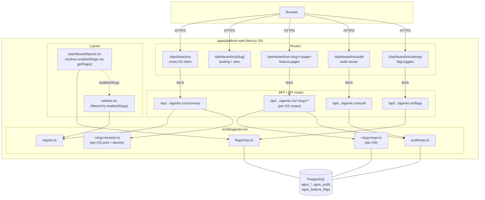

# Agentic OS

> Status: live as of platform/oasis-rollout (May 2026)

The **Agentic OS** layer is the user-facing product surface that ships nine
domain-specific "operating systems" — Health, Maker, Research, Secure-Dev,
CyberSec, Filmmaker, Autobiographer, Business, and Creator — on top of the
shared `platform-web` shell. Each module is a self-contained vertical
(routes + BFF + repo + UI) wired together by a single registry.

This document describes the cross-cutting layer: the registry, the route
shell, the dashboard index, the audit log, the feature-flag gate, and how
to add a new module. Per-OS specifics live in
[`apps/platform-web/content/agentic-os/<slug>.md`](../../apps/platform-web/content/agentic-os/).

For decision records, see:

- [ADR-005 — Agentic OS module registry](../decisions/ADR-005-agentic-os-module-registry.md)
- [ADR-006 — Cross-OS audit log](../decisions/ADR-006-cross-os-audit-log.md)
- [ADR-007 — Per-user feature flags](../decisions/ADR-007-per-user-feature-flags.md)

## TL;DR

```
                    /dashboard/os                ← cross-OS index (live counts)
                    /dashboard/os/[slug]         ← per-OS landing + plan viewer
                    /dashboard/os/<slug>/<page>  ← per-OS feature pages
                    /dashboard/os/audit          ← cross-OS audit viewer
                    /dashboard/os/settings       ← per-user feature flags

apps/platform-web/src/lib/agentic-os/
├── registry.ts                    ← single source of truth (9 modules)
├── plan-loader.ts                 ← reads content/agentic-os/*.md
├── audit/                         ← cross-OS audit log (ADR-006)
├── flags/                         ← per-user feature flags (ADR-007)
├── <slug>/                        ← per-OS repo + session helper
│   ├── repo.ts                    ← Postgres queries
│   └── session.ts                 ← getCurrent<Slug>User + pool
└── ...
```

## Module registry

Every OS has exactly one entry in
[`apps/platform-web/src/lib/agentic-os/registry.ts`](../../apps/platform-web/src/lib/agentic-os/registry.ts):

```ts
export interface AgenticOsModule {
  slug: string;                   // 'health', 'maker', 'filmmaker', ...
  label: string;                  // 'Health OS'
  shortName: string;              // 'Health'
  tagline: string;                // one-line marketing copy
  description: string;            // ~2 sentences
  icon: LucideIcon;               // sidebar + dashboard icon
  status: 'live' | 'preview' | 'planned';
  planFile: string;               // 'health.md' (relative to content/agentic-os/)
  accent: string;                 // tailwind color name for hero/badges
}
```

The registry is the **single source of truth** for what an "OS" is. Three
surfaces read from it:

| Surface                       | What it reads                      |
| ----------------------------- | ---------------------------------- |
| Sidebar nav                   | label, slug, icon, status (badge)  |
| `/dashboard/os` index         | label, tagline, description, accent, status |
| `/dashboard/os/[slug]` shell  | label, planFile (loaded into plan-viewer)   |

`status` semantics:

- **live** — full feature pages, BFF routes, write probes, end-to-end smoke
- **preview** — landing page + plan viewer only; feature pages are stubs
- **planned** — plan viewer only; not advertised in marketing copy

## Architecture diagram



## Data ownership

Each OS owns its own primary table(s) and writes audit rows to the shared
`agos_audit` table. There is no cross-OS schema sharing other than the
audit and flags tables.

| OS                | Primary table(s)                                  | Migration |
| ----------------- | ------------------------------------------------- | --------- |
| Health OS         | `agos_health_profile`, `agos_health_plan`, `agos_health_screeners` | 0003 |
| Maker OS          | `agos_maker_builds`, `agos_maker_parts`           | 0004      |
| Research OS       | `agos_research_hypotheses`                        | 0005      |
| Secure Dev OS     | `agos_securedev_threat_models`                    | 0006      |
| CyberSec OS       | `agos_cyber_alerts`                               | 0007      |
| Filmmaker OS      | `agos_filmmaker_projects`, `agos_filmmaker_shots` | 0008, 0012 (ALTER) |
| Autobiographer OS | `agos_autobiographer_chapters`                    | 0009      |
| Business OS       | `agos_business_contacts`                          | 0010      |
| Creator OS        | `agos_creator_posts`                              | 0011      |
| **Cross-OS** — audit  | `agos_audit`                                  | 0003      |
| **Cross-OS** — flags  | `agos_feature_flags`                          | 0013      |

The full chain lives in
[`packages/database/alembic/versions/`](../../packages/database/alembic/versions/)
and is described in [`docs/operations/alembic-branches.md`](../operations/alembic-branches.md).

## Cross-OS surfaces

### `/dashboard/os` — cross-OS index (Workstream C)

Renders a card per registered module with the live record count and last-updated
timestamp pulled from the [`/api/tiresias/agentic-os/summary`](../../apps/platform-web/src/app/api/tiresias/agentic-os/summary/route.ts)
endpoint. The summary route queries all nine primary tables in parallel via
`Promise.allSettled`, so a single table failure surfaces as a per-OS `error`
field in the response without crashing the whole index. Results are cached
in-memory for 30 seconds keyed by `userId`.

### `/dashboard/os/audit` — cross-OS audit viewer (Workstream D)

Paginated, filterable view of `agos_audit` for the current actor. Filters: OS
slug, action, time range. Cursor encodes `(created_at, id)` as `base64url(JSON)`
so it's opaque to clients but easy to debug. See
[`docs/architecture/audit-log.md`](audit-log.md) and
[ADR-006](../decisions/ADR-006-cross-os-audit-log.md).

### `/dashboard/os/settings` — per-user feature flags (Workstream E)

Toggle each OS on or off for the current user. Flags are resolved
server-side in `(dashboard)/layout.tsx` via `getFlags(userId)`; the resolved
`enabledSlugs` are passed as a prop into the sidebar and mobile-nav, which
filter their nav items accordingly. **Audit log** and **OS Settings** are
always present in the nav regardless of flag state, because both are
cross-OS surfaces. See [`docs/architecture/feature-flags.md`](feature-flags.md)
and [ADR-007](../decisions/ADR-007-per-user-feature-flags.md).

## Per-OS conventions

Every "live" OS implements the same shape:

```
src/lib/agentic-os/<slug>/
├── repo.ts        ← Postgres queries; throws typed errors on validation
└── session.ts     ← getCurrent<Slug>User() + get<Slug>Pool() (re-exports
                     from the shared maker/health session under the hood)

src/app/api/tiresias/agentic-os/<slug>/...route.ts
                   ← BFF: validates input, calls repo, calls recordAudit

src/app/(dashboard)/dashboard/os/<slug>/...page.tsx
                   ← Feature pages

src/components/agentic-os/<slug>/...
                   ← Per-OS UI components

content/agentic-os/<slug>.md
                   ← Plan / spec rendered into the landing page
```

The `session.ts` boundary is intentional: it lets each OS pick its own
identity resolution path (anonymous, soulkey, local-auth) without leaking
that detail into route handlers. In practice they all delegate to the
local-auth session on platform-web, but the indirection keeps room for
future OSes that want guest read access.

### Audit conventions

Every write path calls `recordAudit({ actorId, projectId, osSlug, action, payload })`
**before returning success** to the client. The `osSlug` field uses the
registry slug. Reserved values:

- `'flags'` — flag-change events from the settings page (avoids colliding
  with per-OS rows)
- one of the nine module slugs for everything else

`action` values are stable per-OS strings (e.g. `health.plan.upsert`,
`maker.build.create`, `filmmaker.project.update`). They are not centrally
enumerated — the audit viewer treats `action` as opaque text and exposes
it as a search filter.

### Smoke conventions

[`scripts/smoke-test.py`](../../scripts/smoke-test.py) runs every OS through
a `step_agentic_os_probe` (read) and `step_agentic_os_write` (write) cycle,
plus the three cross-OS endpoints (`summary`, `audit`, `flags`). Eight of
nine OSes have a write probe; **filmmaker is intentionally read-only** in
the smoke matrix because its writes need a real `projectId`. The matrix
ships 10 jobs per PR (all + 9 per-slug); see
[`docs/operations/smoke-matrix.md`](../operations/smoke-matrix.md).

## Adding a new OS

The minimum viable add is:

1. **Migration** — `packages/database/alembic/versions/00NN_<slug>_os.py`,
   chained off the current head, creates `agos_<slug>_*` tables.
2. **Registry entry** — append to `AGENTIC_OS_MODULES` in `registry.ts`.
3. **Plan content** — `apps/platform-web/content/agentic-os/<slug>.md`
   (rendered into the landing page; markdown-only, no frontmatter).
4. **Session + repo** — `src/lib/agentic-os/<slug>/{session,repo}.ts`.
5. **BFF routes** — `src/app/api/tiresias/agentic-os/<slug>/.../route.ts`,
   each one calling `recordAudit` on writes.
6. **Feature pages** — `src/app/(dashboard)/dashboard/os/<slug>/.../page.tsx`.
7. **Components** — `src/components/agentic-os/<slug>/...`.
8. **Smoke probe** — add to `AGENTIC_OS_PROBES` in `scripts/smoke-test.py`.
9. **Summary entry** — add the table + count query to the `/api/.../summary`
   route.
10. **Tests** — repo tests, smoke probe, sidebar regression test if the
    label introduces an ambiguity.

Sidebar/dashboard wiring requires no further changes — the registry drives
both. The `enabledSlugs` filter automatically picks up the new slug; new
OSes default to `enabled = true` for every existing user (see ADR-007).

## What this layer does NOT do

- **No cross-OS schema joins.** Each OS owns its tables; the only shared
  tables are `agos_audit` (append-only) and `agos_feature_flags` (per-user
  toggle). If two OSes need to share data, they go through their own BFF
  routes, not direct SQL joins.
- **No client-side flag resolution.** All flag reads happen server-side in
  the dashboard layout to avoid a flash of un-filtered nav.
- **No third-party telemetry.** Audit rows live in `agos_audit` only; the
  viewer is the only consumer.
- **No agent integration yet.** The OS surfaces are user-facing today.
  Agent access (via SoulKey + the proxy) is a follow-up layer that will
  consume the same BFF routes.
