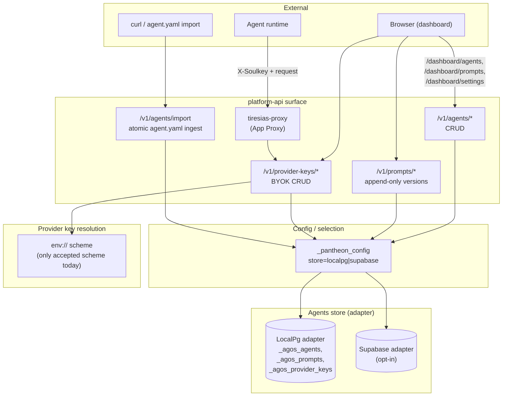

# Agents Platform — Pantheon

This document covers the **Pantheon-level shape** of the W-H agent
platform: stores, CRUD endpoints, BYOK provider keys, and the
`agent.yaml` import flow. It is the architecture-tier companion to:

- [`apps/platform-api/src/agents/agent_yaml_schema.md`](../../apps/platform-api/src/agents/agent_yaml_schema.md)
  — canonical schema reference (W-H.2.f)
- [`apps/platform-api/docs/AGENTS_GUIDE.md`](../../apps/platform-api/docs/AGENTS_GUIDE.md)
  — end-user dashboard guide (Wave I.2)
- [`docs/operations/agents-platform-quickstart.md`](../operations/agents-platform-quickstart.md)
  — curl-driven operator quickstart (Wave I.1)
- [`docs/operations/byok-provider-keys.md`](../operations/byok-provider-keys.md)
  — operator-facing BYOK reference (Wave I.1)
- [`docs/operations/store-adapter-config.md`](../operations/store-adapter-config.md)
  — adapter selection operator reference (Wave I.1)
- [`docs/architecture/store-adapters.md`](./store-adapters.md)
  — adapter pattern internals (companion to this doc)

If you are a **contributor** wanting to know what the moving pieces
are and how they fit together, this is your entry point.

## TL;DR

Pantheon ships a first-class **agent platform** as part of
platform-api: every tenant can register named agents (personas),
attach versioned prompts, attach BYOK provider keys, and import the
whole bundle via `agent.yaml`. The data lives in `_agos_agents` /
`_agos_prompts` / related tables, which are reachable through either
the **LocalPg** adapter (default) or the **Supabase** adapter (opt-in
for tenants who want a hosted backing store).

## Topology



## Component roles

### `_agos_agents`

The agent (persona) table. Owned by the agents store. Holds:

- `tenant_id`, `persona_id` (URL-safe slug, unique per tenant),
  `display_name`, `description`
- `active_prompt_version` — pointer into `_agos_prompts`
- `provider_key_ref` — pointer into `_agos_provider_keys`
- `tags`, `model_policy`, `metadata` (JSONB)
- `created_at`, `updated_at`, soft-delete flag

A SoulKey can be attached to an agent (the SoulKey is the runtime
credential that connects an agent to inbound requests via the App
Proxy); the join key is `persona_id`. See PR #127.

### `_agos_prompts`

The prompts table. **Append-only** — new prompt text creates a new
version row; old versions are kept indefinitely. Holds:

- `tenant_id`, `persona_id`, `version` (monotonic per persona)
- `text`, `template_vars` (JSONB)
- `created_at`, `created_by`

The "active" version per agent is selected by
`_agos_agents.active_prompt_version`; the dashboard surfaces version
history and lets operators flip the active version.

### `_agos_provider_keys`

The BYOK provider key table. Per-tenant. Holds:

- `tenant_id`, `key_id` (URL-safe slug, unique per tenant)
- `provider` (`anthropic`, `openai`, `google`, etc.)
- `secret_ref` — a `platform_secrets` URI reference. `env://VAR_NAME`,
  `file:///path`, `vault://...`, `gcpsm://...`, and `awssm://...` are
  all supported; the BYOK code path delegates to the
  `packages/secrets/python` facade.
- `metadata` (JSONB) — model whitelists, region pins, etc.

The Tiresias App Proxy (`tiresias-proxy`) calls into the provider
keys API per-tenant when resolving outbound LLM credentials.

### CRUD endpoints (`/v1/agents/*`, `/v1/prompts/*`, `/v1/provider-keys/*`)

12 tenant-scoped routes shipped in PR #129 (W-H.2.c). All require an
authenticated session (SoulAuth federated for human operators) or a
service-level credential. None take a tenant ID in the path —
tenant is resolved from the session context.

### Atomic import (`/v1/agents/import`)

A single endpoint that accepts a parsed `agent.yaml` bundle and writes
agent + prompts + provider-key references atomically. If any part
fails, the whole import rolls back. See PR #132 (W-H.2.f) for the
implementation and `apps/platform-api/src/agents/agent_yaml_schema.md`
for the canonical schema.

### Dashboard surface (`/dashboard/agents`, `/dashboard/prompts`, `/dashboard/settings/*`)

Shipped in PR #130 (W-H.2.d) and PR #131 (W-H.2.e). Full CRUD UI for
agents and prompts, with prompt version history, plus a Provider Keys
tab in Settings for BYOK management and an Agents Store tab for
adapter selection.

End-user docs:
[`apps/platform-api/docs/AGENTS_GUIDE.md`](../../apps/platform-api/docs/AGENTS_GUIDE.md).

### Store adapter selection (`_pantheon_config`)

A single config table that records which store adapter is active for
each known concern. The agents-store row is keyed on `store` with
value `localpg` (default) or `supabase`. Adapter pattern is detailed
in [`docs/architecture/store-adapters.md`](./store-adapters.md).

### Tiresias App Proxy linkage

The App Proxy reads the provider keys API to resolve outbound LLM
credentials per-tenant per-call. See PR #131 for the proxy tenant-aware
plumbing and PR #133 (W-J.1) for the Pantheon-built `tiresias-proxy`
that makes W-H BYOK live.

## Data flow: `agent.yaml` import

```
1. Operator (or CI) prepares agent.yaml per the canonical schema
2. POST /v1/agents/import (multipart or JSON)
3. platform-api parses and validates the YAML against the schema
4. validator emits a typed bundle: agent + N prompt versions + key refs
5. store adapter opens a transaction
6. INSERT into _agos_agents (persona_id unique per tenant)
7. INSERT into _agos_prompts for each version, set active pointer
8. INSERT into _agos_provider_keys for each key, with env:// secret refs
9. COMMIT — return the new agent + version list
   FAIL — rollback all, return the validation / DB error
```

## Data flow: provider key resolution (proxy hot path)

```
1. Agent makes a request through tiresias-proxy with X-Soulkey
2. proxy resolves SoulKey → persona_id → tenant_id (via SoulAuth client)
3. proxy looks up the agent's provider_key_ref
4. proxy reads _agos_provider_keys for that key_id
5. proxy resolves secret_ref (env://VAR_NAME → os.getenv(VAR_NAME))
6. proxy uses that secret as the upstream LLM credential
7. response streams back to the agent
```

## Cross-references

- W-H.2.a / W-H.2.a2 — DB foundation, persona_id as natural join key
  (PRs #126, #127)
- W-H.2.b — Store adapter shipped (PR #128) — see
  [`docs/architecture/store-adapters.md`](./store-adapters.md)
- W-H.2.c — CRUD endpoints (PR #129)
- W-H.2.d — Dashboard UI (PR #130)
- W-H.2.e — BYOK provider keys (PR #131)
- W-H.2.f — `agent.yaml` import + schema (PR #132)
- W-J.1 — Pantheon-built `tiresias-proxy` consuming the above (PR #133)

## What this document explicitly does NOT cover

- The `agent.yaml` schema field-by-field — see
  [`agent_yaml_schema.md`](../../apps/platform-api/src/agents/agent_yaml_schema.md).
- The dashboard UI element-by-element — see
  [`AGENTS_GUIDE.md`](../../apps/platform-api/docs/AGENTS_GUIDE.md).
- How to flip the store adapter via SQL — see
  [`docs/operations/store-adapter-config.md`](../operations/store-adapter-config.md).
- How to mint a SoulKey for an agent — see
  [`docs/operations/agents-platform-quickstart.md`](../operations/agents-platform-quickstart.md).
- The Tiresias App Proxy internals — see
  `apps/platform-app-proxy/docs/architecture.md`.
