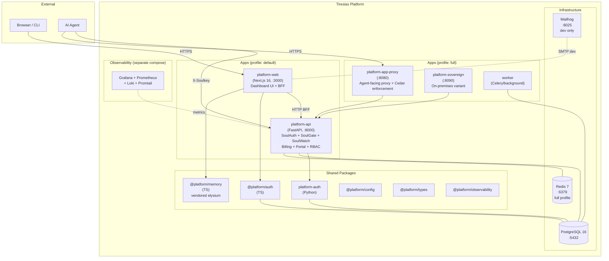

# System Overview

## Architecture Diagram



## Component Roles

### apps/platform-web
The primary human-facing surface. A Next.js 16 application acting as:
- **Dashboard UI**: observability, RBAC management, provider health, cost analytics.
- **BFF (Backend-for-Frontend)**: proxies to `platform-api`, enforces session checks, applies permission gates server-side.
- **Auth gateway**: login, register, forgot-password flows using `@platform/auth`.

### apps/platform-api
The core platform backend — **do not modify business logic**:
- **SoulAuth**: Agent identity resolution via SoulKey tokens.
- **SoulGate**: Policy enforcement point (Cedar-backed).
- **SoulWatch**: Anomaly detection and audit trails.
- **Portal + Sales + SupportMCP**: Customer-facing and ops endpoints.
- **Billing**: Usage metering and invoice sync.

### packages/auth
The local-auth implementation replacing WorkOS AuthKit:
- Argon2id password hashing (memory-hard, resistant to GPU attacks).
- Postgres-backed session management with rolling expiry.
- CSRF protection (double-submit cookie).
- In-memory rate limiting (replaceable with Redis).
- Structured audit event emission.

### packages/memory
Vendored from saluca-labs/elysium. Provides agent memory with:
- Topic-indexed FTS using BM25.
- Hybrid vector search with RRF ranking.
- Temporal decay for relevance scoring.
- SQLite (dev) and PostgreSQL (prod) adapters.

## Data Flow: Human Auth

```
1. User visits /dashboard
2. middleware.ts checks for platform_session cookie
3. No cookie → redirect /login
4. User submits credentials → loginAction (Server Action)
5. Argon2id verify against password_credentials
6. createSession → insert into sessions table
7. setSessionCookie → httpOnly, secure, sameSite=lax
8. redirect /dashboard
9. (dashboard)/layout.tsx → validateSession (DB lookup)
10. Render with user identity + RBAC context
```

## Data Flow: Agent Auth (unchanged)

```
1. Agent sends request with X-Soulkey header
2. platform-api auth/soulkey.py resolves identity
3. pdp.py evaluates Cedar policy
4. Request forwarded or rejected
```
