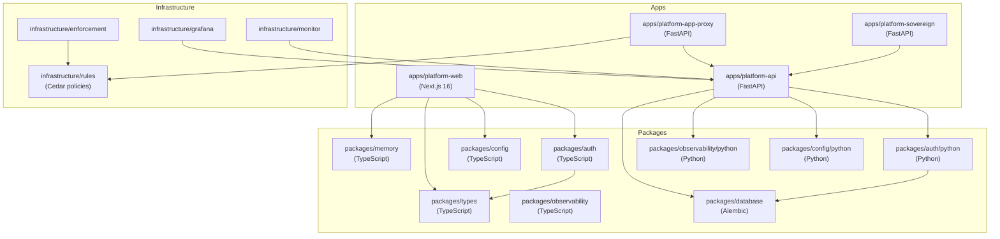

# Dependency Map

Inter-package and inter-app dependency graph as of `platform/unification-v1`.

## Mermaid Graph

## Textual Description

### apps/platform-web
- **Depends on**: `@platform/auth`, `@platform/config`, `@platform/types`, `@platform/memory`
- **Calls**: `apps/platform-api` via HTTP (BFF pattern, `/api/tiresias/*` proxy)
- **Provides**: Dashboard UI, login/register/forgot-password flows, RBAC frontend

### apps/platform-api
- **Depends on**: `platform-auth` (Python), `platform-config` (Python), `platform-observability` (Python)
- **Depends on**: `packages/database` Alembic migrations for schema
- **Provides**: Agent identity (SoulKey), PDP evaluation, billing, portal, RBAC API

### apps/platform-app-proxy
- **Depends on**: `apps/platform-api` (HTTP)
- **Depends on**: `infrastructure/rules` (Cedar policies loaded at runtime)
- **Provides**: Agent-facing reverse proxy with inline policy enforcement

### apps/platform-sovereign
- **Depends on**: `apps/platform-api` (HTTP)
- **Provides**: On-premises deployment variant with self-hosted infrastructure

### packages/auth (TS)
- **Depends on**: `argon2`, `pg`
- **Provides**: `hashPassword`, `verifyPassword`, `createSession`, `validateSession`, `invalidateSession`, `requireSession`, `requireRole`, cookie helpers, CSRF, rate limiter, audit emitter

### packages/auth (Python)
- **Depends on**: `argon2-cffi`, `sqlalchemy`, `itsdangerous`, `fastapi`
- **Provides**: Parallel Python API mirroring the TS half

### packages/memory
- **Vendored from**: saluca-labs/elysium @ 758a4a5
- **Depends on**: `better-sqlite3`, optional `pg`, `sqlite-vec`, `node-llama-cpp`
- **Provides**: Topic index, FTS, hybrid vector search (BM25 + embeddings + RRF), temporal decay
- **Consumed by**: `apps/platform-web` (TypeScript-to-TypeScript only; Python access is a follow-up)
